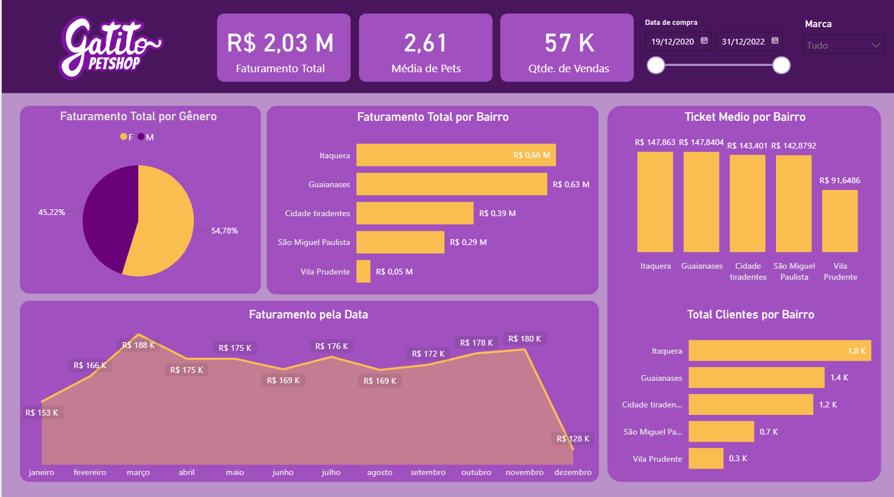
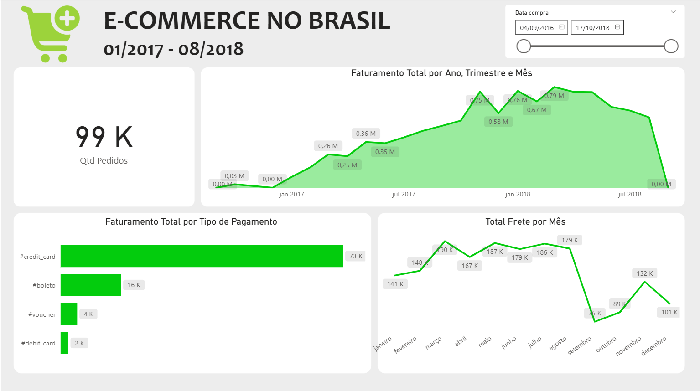
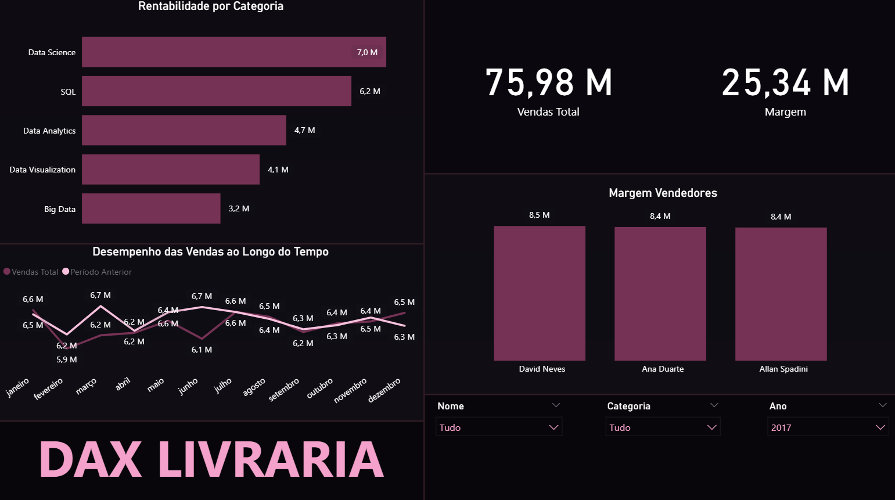
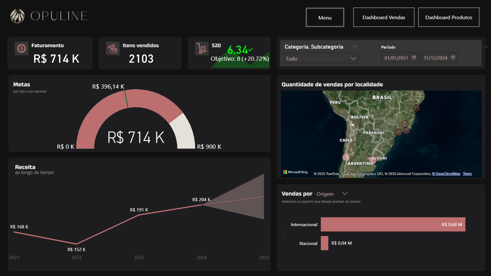
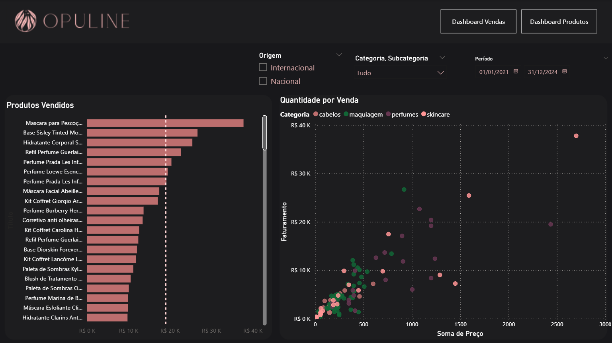

# Portfólio de Análise de Dados 

Coleção de dashboards analíticos desenvolvidos em Power BI para resolução de problemas de negócios.

---

## 1. Dashboard de Gatito Petshop 
* **Objetivo:** Monitorar a performance comercial do Petshop, analisando o faturamento por região, o comportamento de compra por gênero e a evolução das vendas ao longo do tempo para direcionar estratégias de marketing.
* **Principais KPIs:** 
    * **Faturamento Total:** R$ 2,03 Milhões
    * **Ticket Médio:** Analisado por bairro (Itaquera e Guaianases lideram em volume)
    * **Média de Pets:** 2,61 por venda
    * **Volume de Vendas:** 57 mil transações
* **Insights do Dashboard:**
    * O público masculino representa a maior parte do faturamento (54,78%).
    * O bairro de **Itaquera** é o principal polo de receita (R$ 0,66M) e de concentração de clientes (1,8K).
    * Existe uma tendência de crescimento clara no faturamento mensal ao longo do ano.

---

## 2. Dashboard de E-Commerce no Brasil (01/2017 - 08/2018) 
* **Objetivo:** Analisar a evolução temporal do faturamento de uma operação de comércio eletrônico no Brasil, identificando a preferência de métodos de pagamento dos clientes e o comportamento sazonal dos custos de frete.
* **Principais KPIs:** 
    * **Quantidade de Pedidos:** 99 Mil
    * **Meio de Pagamento Dominante:** Cartão de Crédito (`#credit_card`) liderando isolado com 73K transações.
    * **Pico de Faturamento Mensal:** R$ 0,79M atingido no início de 2018.
* **Insights do Dashboard:**
    * **Preferência de Pagamento:** O cartão de crédito é a escolha disparada dos consumidores (73K), seguido por boleto bancário (16K), vouchers (4K) e cartão de débito (2K).
    * **Tendência de Crescimento:** O faturamento total apresenta uma curva acentuada de crescimento ao longo de 2017, consolidando-se em patamares elevados no primeiro semestre de 2018.
    * **Análise de Frete:** O custo total com frete atinge seus maiores picos entre os meses de março e agosto (chegando a 190K), apresentando uma queda brusca e sazonal em setembro.

---

## 3. Dashboard DAX Livraria (Performance Comercial e Rentabilidade) 
* **Objetivo:** Avaliar a performance financeira e comercial de uma rede de livrarias, destacando os setores e categorias mais lucrativos, a consistência de vendas ao longo do ano e a contribuição individual da equipe de vendas para a margem de lucro.
* **Principais KPIs:** 
    * **Vendas Total:** 75,98 Milhões
    * **Margem Total:** 25,34 Milhões
    * **Categoria Mais Rentável:** Data Science (liderando com 7,0M)
* **Insights do Dashboard:**
    * **Análise por Categoria:** O setor focado em tecnologia e dados é o motor de rentabilidade da empresa, com as categorias *Data Science* (7,0M), *SQL* (6,2M) e *Data Analytics* (4,7M) ocupando o top 3.
    * **Desempenho Estável:** O gráfico de linha temporal aponta uma operação madura e com faturamento muito estável, oscilando de forma controlada entre 5,9M e 6,7M mês a mês, mantendo um acompanhamento linear em relação ao período anterior.
    * **Performance da Equipe:** A força de vendas exibe um resultado extremamente equilibrado. Os três principais vendedores apresentam resultados de margem quase idênticos: David Neves (8,5M), Ana Duarte (8,4M) e Allan Spadini (8,4M).

---

## 4. Dashboard Opuline Cosméticos (Visão de Vendas e Análise de Produtos) 
* **Objetivo:** Controlar o desempenho de vendas globais de uma marca de cosméticos de alto padrão, permitindo o acompanhamento de metas financeiras, distribuição geográfica das vendas e dispersão de faturamento por preço e categoria de produto.
* **Principais KPIs:** 
    * **Faturamento Total:** R$ 714 Mil
    * **Itens Vendidos:** 2.103 unidades
    * **S2D (Objetivo):** 6,34 (Desempenho de +20,72% acima da meta estipulada)
* **Insights do Dashboard:**
    * **Análise Multidimensionais (Vendas vs. Produtos):** O projeto conta com navegação interna dinâmica entre abas dedicadas para a gestão estratégica de vendas e detalhamento de estoque/produtos.
    * **Mercado Consumidor:** A operação é fortemente impulsionada pelo mercado **Internacional**, que responde por R$ 0,68M do faturamento total, enquanto o mercado Nacional representa R$ 0,04M.
    * **Gestão de Metas e Evolução:** A marca superou com folga a meta intermediária de R$ 396,14 K, caminhando de forma consistente em uma curva de crescimento anual acelerada desde 2022.
    * **Dispersão e Mix de Produtos:** Através do gráfico de dispersão, identifica-se a concentração de vendas em categorias de *skincare*, *perfumes*, *maquiagem* e *cabelos*, mapeando com clareza quais produtos geram maior volume financeiro em relação ao seu preço de venda.

